- [Diagramma Delle Classi](#diagramma-delle-classi)
  - [Struttura Bozza Di Progetto Java](#struttura-bozza-di-progetto-java)
  - [Struttura Bozza Di Progetto Spring](#struttura-bozza-di-progetto-spring)
  - [Bozza Di Analisi Preliminare Progetto Java](#bozza-di-analisi-preliminare-progetto-java)
- [Casi D'Uso](#casi-duso)
  - [Gestione Filiere E Prodotto](#gestione-filiere-e-prodotto)
  - [Gestione Contenuti](#gestione-contenuti)
  - [Gestione Eventi E Partecipazioni](#gestione-eventi-e-partecipazioni)
  - [Gestione Ordini](#gestione-ordini)
- [Diagramma Di Sequenza](#diagramma-di-sequenza)
  - [Esempio Creazione Utente Con Profilo Specifico (Produttore)](#esempio-creazione-utente-con-profilo-specifico-produttore)
  - [Esempio Creazione Supply Chain E Product](#esempio-creazione-supply-chain-e-product)
  - [Esempio Creazione Contenuto Di Tipo Certificato](#esempio-creazione-contenuto-di-tipo-certificato)
  - [Esempio Creazione Contenuto Su Supply Chain Point](#esempio-creazione-contenuto-su-supply-chain-point)
  - [Esempio Creazione Eventi](#esempio-creazione-eventi)
  - [Esempio Creazione Ordini Per Market Place](#esempio-creazione-ordini-per-market-place)

[**Home**](../../Readme.md)

# Diagramma Delle Classi
## Struttura Bozza Di Progetto Java
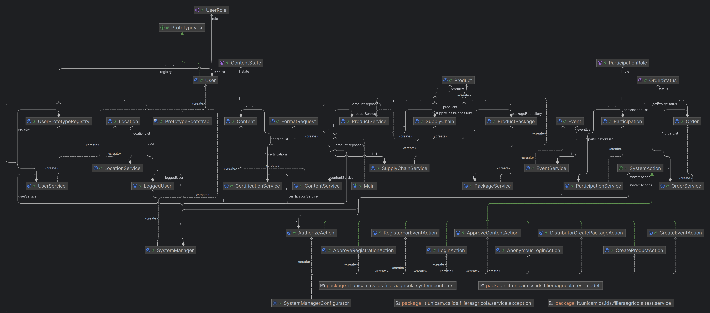 

## Struttura Bozza Di Progetto Spring
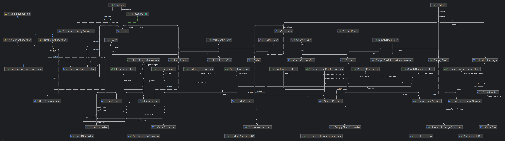 
## Bozza Di Analisi Preliminare Progetto Java
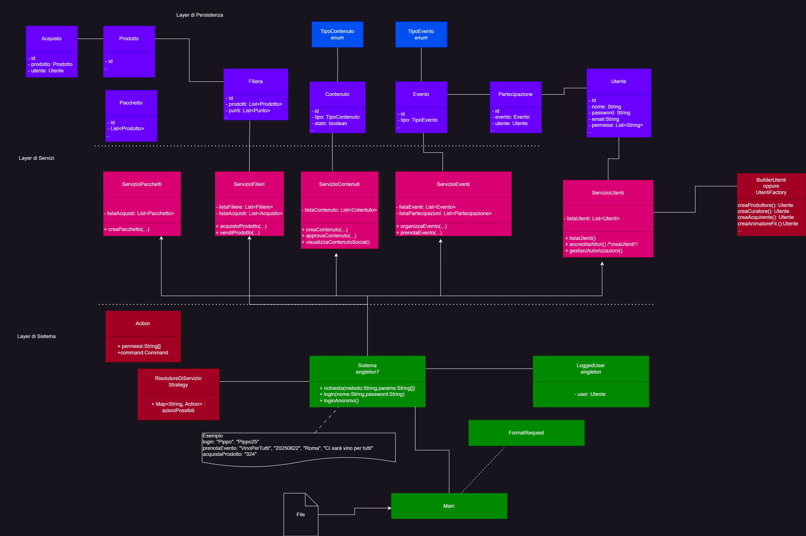

# Casi D'Uso
## Gestione Filiere E Prodotto
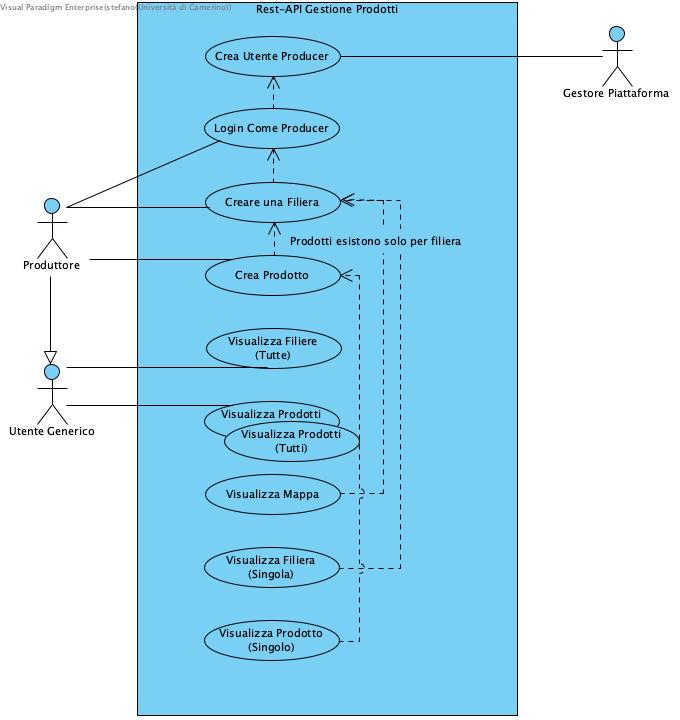 
## Gestione Contenuti 
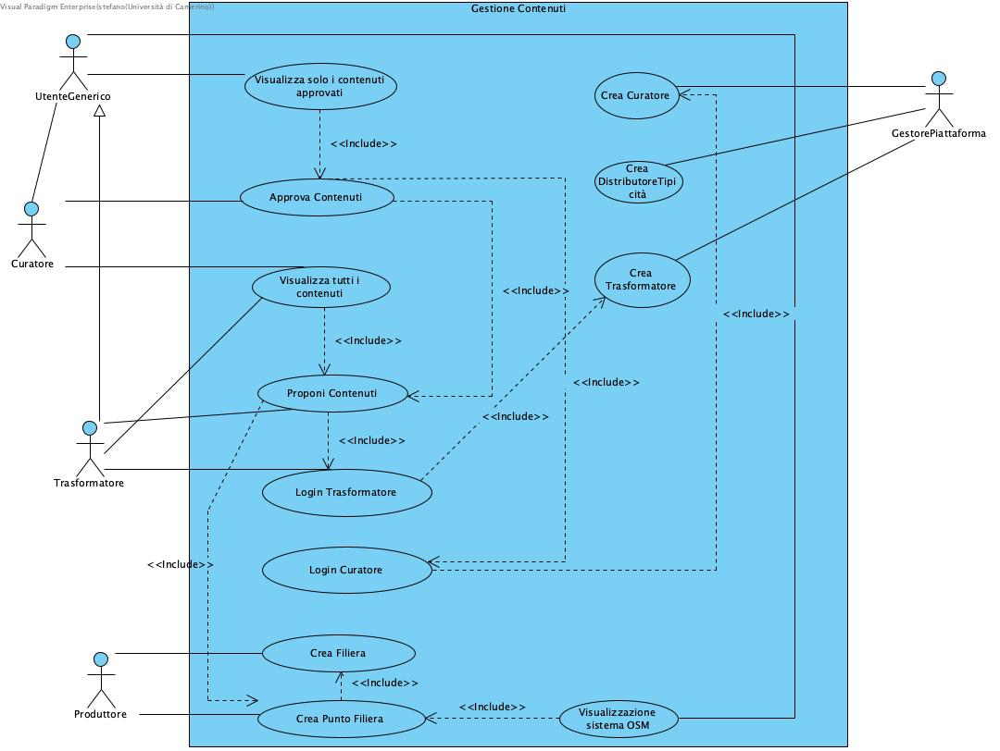 
## Gestione Eventi E Partecipazioni 
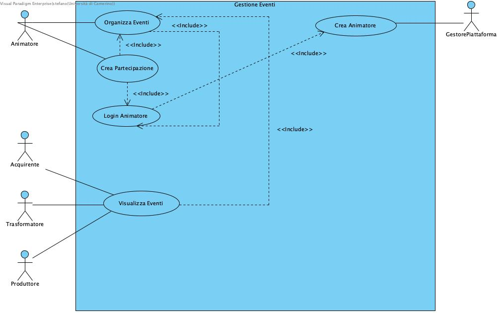 
## Gestione Ordini
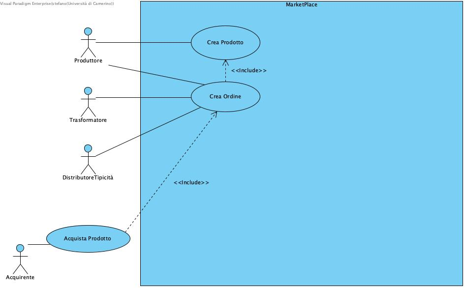 

# Diagramma Di Sequenza
## Esempio Creazione Utente Con Profilo Specifico (Produttore)
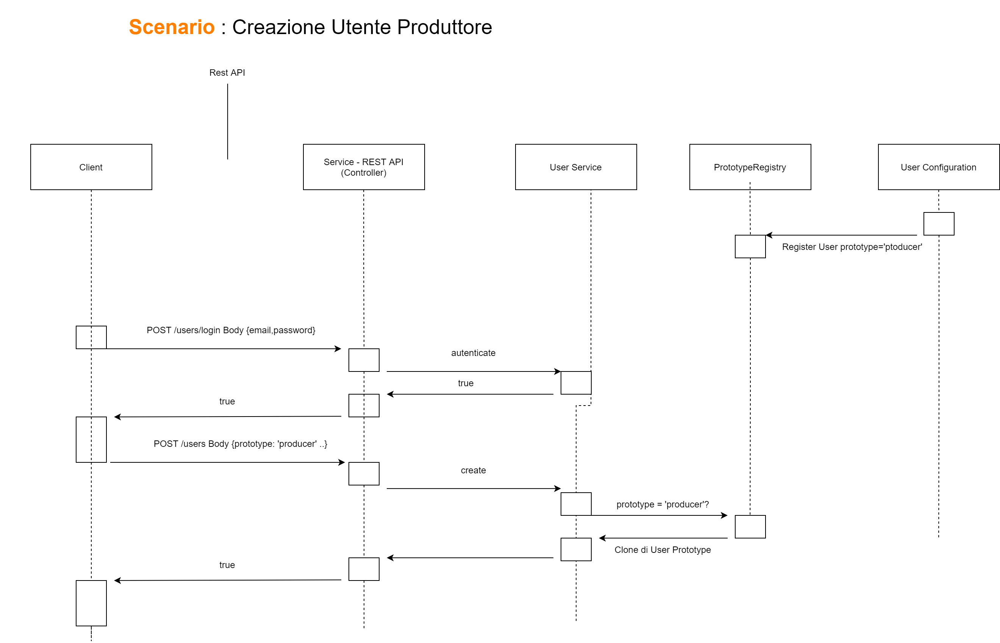 
## Esempio Creazione Supply Chain E Product
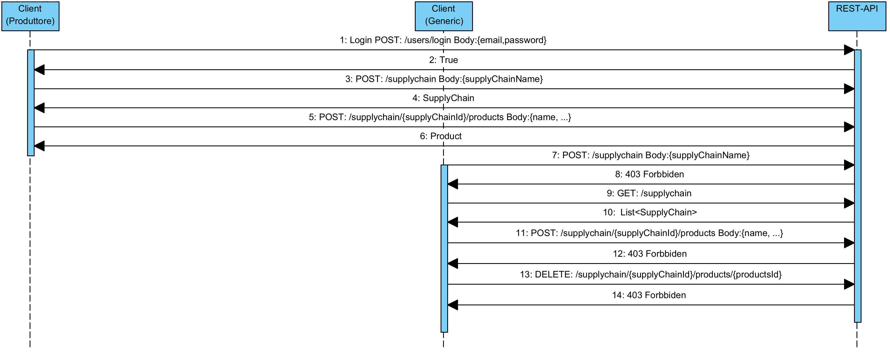
## Esempio Creazione Contenuto Di Tipo Certificato
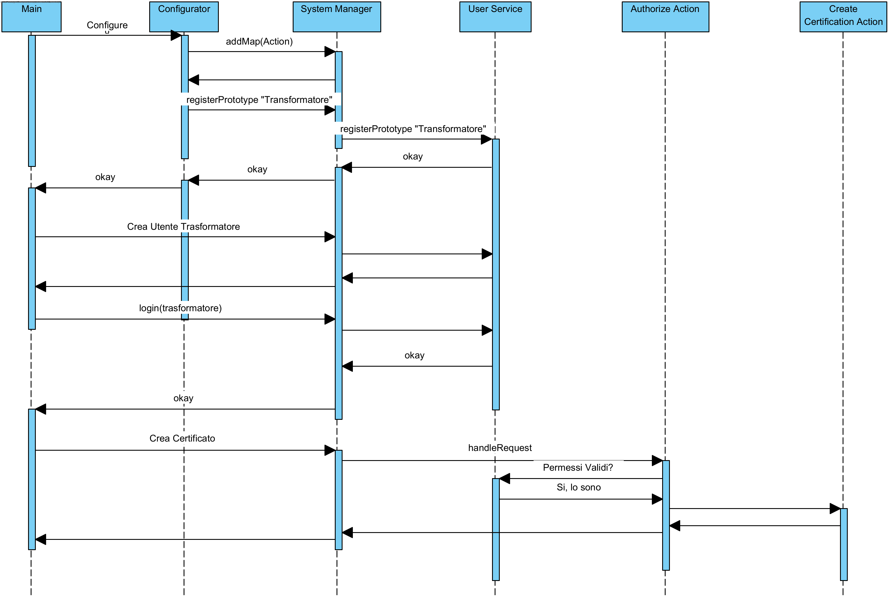 
## Esempio Creazione Contenuto Su Supply Chain Point
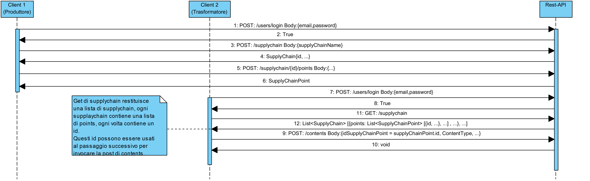 
## Esempio Creazione Eventi 
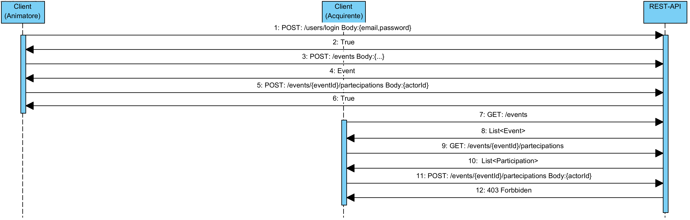 
## Esempio Creazione Ordini Per Market Place
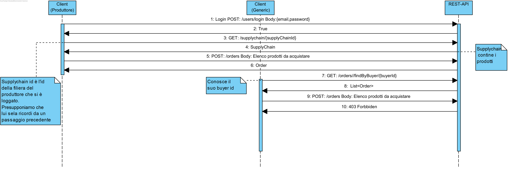 
