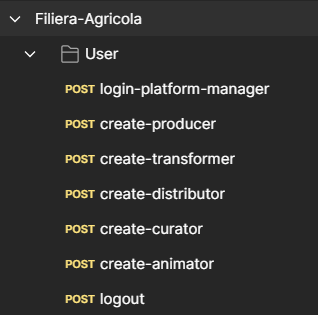
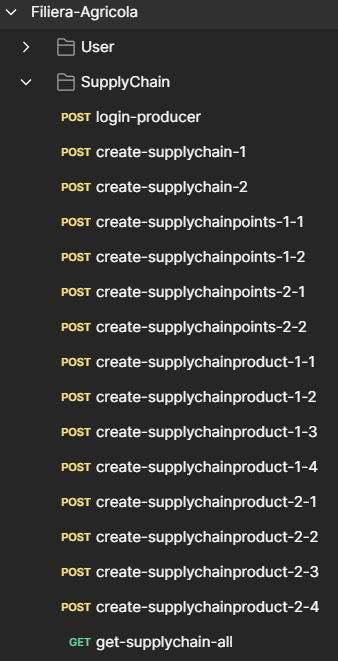
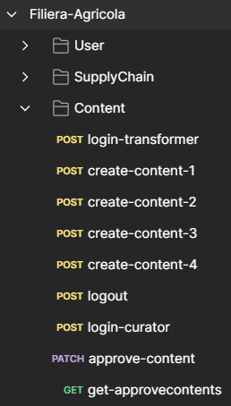
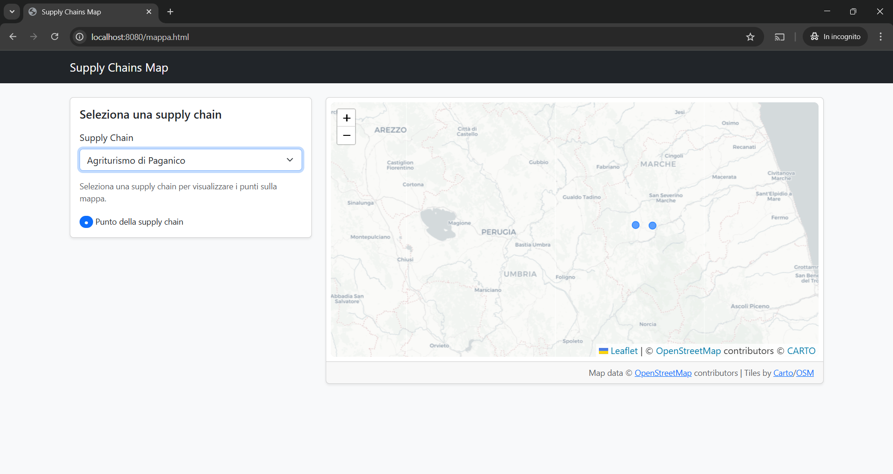

# Indice

- [Indice](#indice)
- [Link Collezione Di Esempio Postman](#link-collezione-di-esempio-postman)
- [Esempi](#esempi)
  - [User](#user)
  - [Supply Chain](#supply-chain)
  - [Content](#content)
- [Mappa Interattiva](#mappa-interattiva)

# Link Collezione Di Esempio Postman

è possible accedere alla collezione tramite un account postman
 
[Link Collezione Postman](https://crimson-robot-96633.postman.co/workspace/IDS~15b6ba47-7b37-47e2-a04e-60b736cc4669/collection/28308783-18089787-3942-41d7-929F5-728bd7b03b9c?action=share&creator=28308783)

[**Home**](../../../Readme.md)

# Esempi

## User

Generazione utenti di diverse categorie.

## Supply Chain

Generazione filiere, prodotti e punti di filiera.

## Content

Generazione contenuti e approvazione.

# Mappa Interattiva

Esempio mappa interattiva con punti generati dall'esempio della supply chain

